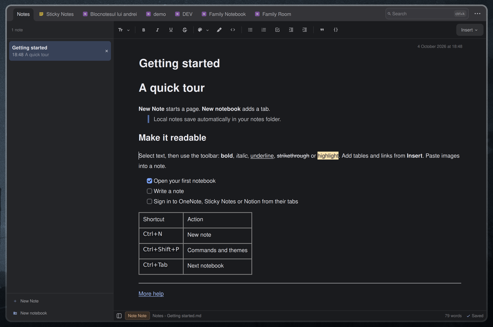

# Note Note

A Linux notes workspace, available as an **Omarchy shell plugin** and a
**standalone Qt 6 application** from this repository. Both run the same
editor, notebook tabs, note list, autosave and providers. The default System theme follows the desktop palette; custom JSON themes
are selected through the command palette. Local Markdown notes, your
Microsoft Sticky Notes, OneNote and Notion pages all live in the same list.

OneNote saves fetch the current page and merge independent edits made on
other devices. Conflicts pause saving for review, with a private recovery
draft kept on this device. See [merge behavior and limits](lib/notemerge/README.md).



**[Install plugin](#install)** · **[Standalone app](#standalone-app)** · **[Update](#update)** · **[Shortcut](#shortcut)** ·
**[Removal](#removal)** · **[Settings](#settings)** ·
**[Notebooks](#notebooks)** · **[Providers](#providers)** · **[Writing plugins](#writing-plugins)** · **[Keys](#keys)**

## Themes and commands

Press **Ctrl+Shift+P** to search commands. New Note, New Notebook, Open Settings,
Toggle Sidebar, and Delete Note use the same actions as their existing controls.
Available shortcuts appear on the right; Delete Note still asks for confirmation.
Shortcut labels follow the central registry. Plugins can declare defaults, and
Settings `keybindings` can override or unbind them without a plugin update.
See [changing bindings](docs/commands.md#changing-bindings) for examples.

Press **Ctrl+Shift+P**, then choose **Color Theme**. Arrow keys
preview; Enter saves; Escape restores the previous theme. Copy JSON themes to
`~/.config/notenote/themes/` and restart to discover them. See [themes](docs/themes.md),
[commands](docs/commands.md), and [plugin packages](docs/plugins.md).

The standalone app includes the native display helper. Omarchy commands and
custom themes require `sh cpp/build.sh` in the plugin folder followed by a
shell restart. Without it the existing editor remains available with System
colors. Theme changes preserve notes, undo history and authored colors.

## Writing plugins

A plugin package can add color themes, command-palette commands with their
shortcuts, editing-toolbar tools that insert or format text in the note, and
providers that bring notes from a new backend. To have an AI
assistant write one, give it the
[`note-note-plugin` skill](skills/note-note-plugin/SKILL.md): it teaches the
manifest, each kind's contract and the safety rules, and it checks a package
with the app's own validator. For Claude Code:

```bash
git clone --depth 1 https://github.com/andreivinca/omarchy-note-note.git
mkdir -p ~/.claude/skills
cp -r omarchy-note-note/skills/note-note-plugin ~/.claude/skills/
```

Then ask for what you want: *"Make me a Note Note theme in Nord colors"*,
*"Add a Note Note toolbar button that inserts today's date"* or *"Write a Note
Note provider for my Nextcloud notes"*. Other assistants that
read `SKILL.md` folders take the same directory. Packages with code start
disabled until you have read and enabled them; see [plugin packages](docs/plugins.md).

## Install

```bash
omarchy plugin add https://github.com/andreivinca/omarchy-note-note.git
omarchy plugin enable io.github.andreivinca.note-note
```

Plugins land disabled so you can read the code first. It's QML plus small
Python scripts with bundled dependencies; it talks to Microsoft Graph only
after you sign in, and like every Omarchy plugin it runs unsandboxed inside
your shell.

Project code is MIT-licensed; bundled components retain their own licenses,
including GPL-2.0-or-later for `merge3`. See [third-party components](NOTICE.md).

## Standalone app

An installable **Flatpak bundle** provides the standalone app with a shared
Qt runtime. See [Flatpak installation and builds](docs/flatpak.md).
After installing the build tools listed there, run `./build-flatpak.sh`
to create a bundle and checksum under `build/dist/<version>/`.

Building and running natively requires Linux, Qt **6.8 or newer** (Quick, Quick Controls 2, Network and
SVG image support), Python **3.9 or newer**, and `inotifywait` from
inotify-tools. Qt Multimedia is optional: it plays OneNote recordings.
Building also requires CMake 3.21+, a C++17 compiler and Qt
Test when tests are enabled. No Omarchy or Quickshell installation is needed.

```bash
cmake -S . -B build -DCMAKE_BUILD_TYPE=Release
cmake --build build --parallel
./build/note-note
```

Install the binary, desktop entry, icon and resources for your user:

```bash
cmake --install build --prefix "$HOME/.local"
```

The app then appears as **Note Note** in your launcher. A second launch
activates the running window. Closing waits for accepted saves; a failed
save keeps the window and draft available to retry.

The standalone app follows your system colors: Omarchy themes, KDE color
roles, or Qt desktop integration and GNOME/desktop portal preferences.
Colors update live, with a built-in palette when no system colors are
available. See [system color support](docs/standalone.md#system-colors).

The plugin and native standalone use `~/.config/notenote/config.json` and the same local notes.
The standalone app keeps its own sessions, sign-ins and caches under
`~/.local/state/notenote/` and `~/.cache/notenote/`; sign in separately there.
XDG directory overrides are supported. See [standalone development and
architecture](docs/standalone.md) for dependencies, installation, storage
and testing. The Flatpak has its own settings and sign-ins under
`~/.var/app/io.github.andreivinca.note-note/`, with access to `~/Notes`.
[Release archives](docs/standalone.md#release-archives) can also be created for each host.

## Update

```bash
omarchy plugin update io.github.andreivinca.note-note
```

## Shortcut

Omarchy plugins don't register a shortcut on their own — bind one yourself:

```lua
-- ~/.config/hypr/bindings.lua
o.bind("SUPER + PERIOD", "Note Note", "omarchy-shell shell toggle io.github.andreivinca.note-note")
```

## Removal

```bash
omarchy plugin remove io.github.andreivinca.note-note
```

Your notes stay in `~/Notes/`. Two files are left behind on purpose, since
they're yours rather than the plugin's: `~/.local/state/omarchy/note-note.json`
(layout state) and, if you signed in to Microsoft,
`~/.local/state/omarchy/note-note-ms-*.json` plus the caches under
`~/.cache/omarchy/note-note-*`. Sign out from the sidebar first to drop the
token, or delete those files by hand.

## Settings

Open the menu (⋯, top right) and pick **Settings** to edit note-note's own
config directly as JSON. (**Key bindings**, in the same menu, opens the same
kind of page over every shortcut the app answers to — read-only.) It opens in place of your notes, saved with **Save**
or `Ctrl+S` — the page stays open, so a rejected edit is still there to fix.
The ✕ at its top right, `Esc`, or any notebook tab takes you back. The file
lives at `~/.config/notenote/config.json` and is pre-filled with every
setting on first run.

- `editor.toolbar` — ordered groups of editing-tool IDs. Move IDs between
  the group arrays to rearrange the buttons, or into
  `{ "dropdown": "insert", "items": ["table", "link"] }` to place them in
  Insert. Dropdowns can contain other dropdown objects to create submenus.
  Unlisted tools appear at the end. **Insert → Insert month** contains
  `currentMonth`, `nextMonth` (insert immediately), then `customMonth`
  (choose a month and year first), from the built-in calendar plugin
  (`org.note-note.calendar`).
  All three use the OS locale's week start and labels for providers that support
  tables. Layout changes apply on Save;
  see [the layout examples and tool IDs](docs/editing-tools.md#arrange-the-toolbar).
  **Insert → Diacritics** offers lowercase and uppercase letters for the language
  chosen at the top of the picker, such as Romanian **ă â î ș ț**. The system
  timezone preselects it, Romanian for `Europe/Bucharest`, and you can pick
  another. Click a letter to insert it at the caret, or select it with arrow keys
  and Enter; see [region detection](docs/editing-tools.md#diacritics).
- `providers.<id>.enabled` — hide a source (`local`, `sticky`, `onenote`,
  `notion`, or an external provider's own id) from the sidebar. Reordering
  the `providers` object reorders the sidebar tabs to match.
- `providers.local.notesDir` — where local notebooks live, overriding
  `~/Notes/` or `NOTE_NOTE_DIR`.
- `providers.<id>.notebookTabs` — `true` spreads a source's notebooks into
  a tab each across the top (the default for local notebooks and OneNote);
  `false` folds them into one tab as an expandable tree.
  Offered by the sources that have notebooks: `local` and
  `onenote` — Sticky Notes and Notion are a single flat list either way.

## Notebooks

Notebooks are folders under `~/Notes/` (override with `NOTE_NOTE_DIR`, or
the `providers.local.notesDir` setting); notes are Markdown files inside
them. An unused notes directory starts with a `Notes` notebook and a short
**Getting started** note. Existing notebooks and root notes are preserved;
refreshing never recreates a deleted starter note.
Notes sitting directly in `~/Notes/` show up as a "Notes" notebook.
The title is stored in a front-matter block at the top of the file:

```
---
title: Shopping
---
milk, eggs
```

A note with no title shows the first words of its body in the list instead.

Each source and notebook gets its own tab across the top; click one, or
`Ctrl+Tab` through them. Use `Alt+1` through `Alt+9` to open the corresponding
tab from left to right; numbers without a tab do nothing.
Whether a source's notebooks spread into a tab
each or fold inside a single tab is per source — the `notebookTabs`
setting; your local folders spread by default, OneNote folds. Local notes offer
**New Note** and **New notebook** at the bottom. OneNote offers **New section**
in its footer and **New Note** only inside each section.
Providers supply all footer actions, including creation
and account controls; every action uses the same full-width, stacked row.
Lists keep their provider’s note order. Drag local notes to reorder them. Notebook trees keep
their provider’s hierarchy and order. Delete a note with the `×` on
its row. Rename or remove a notebook by renaming or removing its folder.

The body is Markdown, rendered live and saved back as Markdown, with a
formatting toolbar for headings, lists, tables, links, images and the usual
bold/italic/underline/strikethrough/highlight/code shortcuts (`Ctrl+B/I/U/S`,
`Ctrl+Shift+H`). Hover a link to see its destination in the bottom view bar;
click the link itself to open it in your browser or the associated app.
Web addresses (`https://`, `http://`, and `www.`) use the theme accent and an underline as
you type, even when they are plain text in Markdown. Drag across a link to
select it. The display styling leaves saved Markdown and cursor spacing
unchanged. Type a space to continue with ordinary text after a URL. A new
list item starts with ordinary text.
Existing OneNote audio attachments, including phone recordings in 3GP format,
show an inline player: a round Play/Stop button beside the recording's title,
with a seek bar and the time beneath it. Opening a page downloads none of its
recordings: one is downloaded the first time you press Play, and plays from
the cache after that. Stop returns to the beginning. Switching notes stops playback. You can
edit notes containing recordings; ordinary text edits retain the original
attachment. Pasting a recording copies it, and a copy is uploaded again: a
save can upload at most 3 MB per recording, under Graph's 4 MB request limit.
Pasting back a recording cut from the same note moves it, keeping its
attachment, unless the cut was saved first: then it is uploaded again, within
the same limit. Without Qt Multimedia, notes with
recordings still open and edit; the player says that playback needs it.
Recording and insertion tools are not provided yet.
Local and OneNote notes support tables inside table cells, including
**Insert → Insert month → Insert current month**. Place the caret in a cell before inserting;
row and column tools act on the table containing the caret.
Backspace immediately after a table deletes it; undo restores the whole table.
Search filters by title as you type and by body a moment
later. OneNote builds a private text cache in the background and shows how
many pages are searchable while it fills; searches then use the saved text.
Indexing reads page text without downloading images or attachments. See
[OneNote search](docs/onenote-search.md) for sync and coverage details.
Notion remains title-only because its API does not expose body search.
In the Omarchy plugin, **Detach**, in the menu at the top
right, turns the overlay into an ordinary window you can keep open beside
your work; **Back to overlay** brings it back.

## Providers

Every source of notes is a self-contained *provider* — a folder with a
`Provider.qml` implementing one small contract: rows for the sidebar,
`load` / `save` / `create` / `remove`, and a few capability flags.

- `plugins/org.note-note.local/` — Markdown notebooks on disk
- `plugins/org.note-note.sticky/` — Microsoft Sticky Notes
- `plugins/org.note-note.onenote/` — OneNote
- `plugins/org.note-note.notion/` — Notion
- `services/microsoft/` — Microsoft sign-in code the two above run; each
  has its own app registration, token and scope, so nothing about one's
  account touches the other's, and signing out of one leaves the other
  signed in.

New external providers go in `~/.config/notenote/plugins/<package>/` with a
`plugin.json` manifest. Review the code, enable the package in Settings, then
restart. Both hosts use this shared package location. Legacy host-specific
provider folders remain supported for the 1.x migration window. See the
[provider contract](docs/providers.md), [package policy](docs/plugins.md), and
the minimal `examples/hello/` package.

## What it accesses

- **Your notes on disk**: `~/Notes` (or `NOTE_NOTE_DIR`) — nothing else on
  the filesystem beyond its own state and cache under
  `~/.local/state/omarchy/` and `~/.cache/omarchy/` (plugin), or
  `~/.local/state/notenote/` and `~/.cache/notenote/` (standalone).
- **Microsoft account, only after you sign in**: `Mail.ReadWrite` (Sticky
  Notes are stored in your mailbox), `Notes.ReadWrite` (OneNote), and `User.Read`.
  OneNote requests `Files.Read` alongside `Notes.ReadWrite` during sign-in.
  This permission allows reading your OneDrive files;
  the provider uses it for resolving shared notebook links, notebook file listings and `.onetoc2` metadata
  containing OneNote's custom section order. No separate local order is used.
  Section order loads automatically. If this permission becomes unavailable,
  normal note access continues with sections sorted alphabetically.
  Each provider's token is separate and owner-only; signing out
  deletes only that one. The plugin talks to `login.microsoftonline.com` and
  `graph.microsoft.com`; OneNote metadata downloads also use Microsoft's
  signed file URLs under `files.1drv.com`, `storage.live.com`, `sharepoint.com`
  or `microsoftpersonalcontent.com`, without forwarding the Graph token.

OneNote custom section ordering is a **high-risk compatibility workaround**,
not a supported Graph ordering API: it uses a custom TOC parser and an
unguaranteed Graph/OneDrive ID mapping. See the
[risk assessment](docs/onenote-section-order.md#risk-classification).
It currently supports personal OneDrive notebook
packages with a unique readable `.onetoc2` per folder. Section groups are
flattened in their remote order. If metadata is unavailable, malformed,
ambiguous or no longer matches Graph, the affected notebook's sections are
sorted alphabetically and a warning is shown. Stale custom ordering is not
used as a fallback. Page ordering still comes directly from Graph.

Developer-facing documentation (architecture, security rules, testing,
releases) lives in [`docs/`](docs/README.md).

## Keys

| Key | Action |
|---|---|
| `Esc` | clear search, else close (saves first) |
| `Ctrl+N` | new note in the current notebook |
| `Ctrl+Shift+N` | new notebook |
| `Ctrl+Tab` / `Ctrl+Shift+Tab` | next / previous notebook tab |
| `Ctrl+K` | search |
| `Ctrl+E` | hide the sidebar, or bring it back |
| `Ctrl+D` | delete current note |
| `Ctrl+B` / `Ctrl+I` / `Ctrl+U` / `Ctrl+S` | bold / italic / underline / strikethrough |
| `Ctrl+Shift+H` | highlight the selection |
| `Ctrl+↓` / `Ctrl+J` | next note |
| `Ctrl+↑` | previous note |
