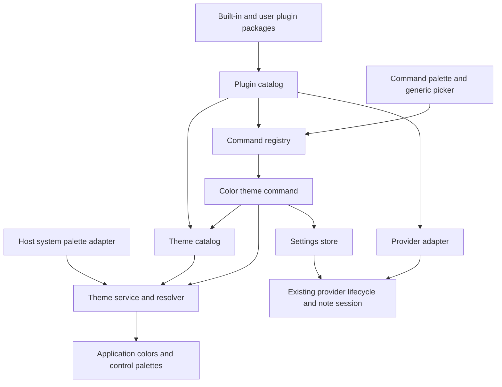

# original ai query

we have to plan a very big feature: Theme.
Untill now, we tried as best as possible to use the system theme, but we will have to implement some theming. The task will be bigger than it seems.
For this, we will start to make the app more modular. So, we will not hardode the theme, but there will be theme plugins, or config file. Or we should use a config file, with specific keys, and its colors, but for the value we can use something like "system", so the theming functionality to resolve the color from the OS. It sounds good, so then we will have a Theme folder or something like that, with one config file "native" or "system" or "default" or maybe you find a better name, with all the values on "system", si the app uses the OS theme pallete by default, but we will add other theme (config files) after that.

How the user will change the theming is another big feature:
we will implement a VSCode command like. Ctrl + Shift + P will open in a very vscode similar way and the user can type commands there, and our Theme color will be the first command.
but before implomenting the Theme command, we have to implement the command like very modular: to load commands (other files?) and each command to load it's resources as it wants. For example our theme comand will be a file somewhere, the application to know to load these command files, and the command will have the logic,  that loads it's theme files and any external file it wants. In the future there will be other commands by default, or the user can add their own commands.
It should be design like a plugin based, so in the future maybe we will deploy a plugin store. There wil be plugins that can add who knows what: More theme, more commands, more who knows what.
We already have the notes provider plugins, we will extends the system to make it more modular, so the direction of the app is to make it even more modular.

You don't have to write the code, but to make the most comprehensive plan as you can, with particular emphasis on code quality: readability, simplicity, maintainability, and sound design. Identify and fix concrete issues without unnecessary complexity, then verify the changes with appropriate checks.


# Themes, command palette, and application plugins

Status: core implementation completed, 2026-09-27; release validation noted below. The core settings transaction,
package catalog, commands/picker, theme resolver, native display styling, appearance
command, provider relocation, and install rules are implemented. Public contracts
are in [themes](../themes.md), [commands](../commands.md), and [plugins](../plugins.md).

Verified so far: native and Omarchy extension workflows, existing provider/editor
regressions, content-preserving native display styling, native installed layouts,
and the Flatpak bundle build. Remaining release validation includes the Flatpak runtime (the installed
application was running during this implementation), fractional/high scaling,
and the full desktop/overlay/detached visual matrix. Performance budgets below
remain targets, not measurements. The script-only Omarchy editor is explicitly
System-only; custom themes and commands require the native helper.

The original design below records the intended roadmap. Where API spelling or
limits differ, the focused public documentation describes the implemented contract.

## 1. Recommended direction

Use **declarative JSON color themes**, a **generic command registry and command
palette**, and **small application plugin packages** that can contribute themes,
commands, and, through an adapter, note providers. A theme is data; a command is
code; a plugin is the package that distributes either or both. They should not
be three competing extension systems.

Ship one built-in theme named **System**, stored as `themes/system.json` inside
the built-in appearance plugin. Every supported color key in that file is
`"system"`. The application resolves those values through its existing desktop
or Omarchy adapter. System is clearer than Native (which suggests native
widgets) or Default (which describes selection rather than behavior).

`Ctrl+Shift+P` opens a searchable command palette near the top center of the
application. The first product command is **Preferences: Color Theme**. It opens
a generic choice picker, previews the selected theme, commits on Enter, and
restores the committed theme on cancellation. Neither the palette nor the
workspace knows how theme files work.

Build the command framework and verify it with a fixture command **before**
implementing the theme command. Theme resolution can be developed independently
behind the existing UI. Complete the provider integration in a later phase of
the same roadmap, preserving provider IDs, settings, state, and save semantics.

The first release does not need a store, dependency solver, permission language,
theme expression language, or arbitrary UI injection. It needs explicit
contracts that can be extended without rewriting the core.

## 2. Product requirements and scope

### Required outcomes

1. Existing installations continue to follow their system colors by default,
   including live desktop color changes and existing fallback behavior.
2. Users can add a JSON theme without writing executable code or recompiling.
3. Users can add a command package with its own implementation and resources
   without editing application source or registering it in `Workspace.qml`.
4. Built-in and external contributions use the same validation and contracts.
   Built-in trust and the protected recovery theme are explicit exceptions.
5. The palette works in the standalone application, Flatpak, Omarchy overlay,
   and detached Omarchy window, including when Settings is open.
6. Switching or previewing colors never edits a note, clears undo, moves the
   caret, starts a save, cancels an accepted save, or reloads a provider.
7. Invalid packages and missing selections produce useful diagnostics and a
   usable application. No startup code execution is needed to discover a theme.
8. Theme files, plugin manifests, and extension APIs have separate versions.

### Explicitly deferred

Fonts, spacing, border radii, icon packs, animation settings, arbitrary style
scripts, scheduled light/dark themes, a theme editor, command history, user
keybinding customization, marketplace installation/update UI, plugin dependency
resolution, and a sandboxed extension process. Existing style metrics continue
to come from `design/Style.qml` and the host.

Future toolbar/status-bar contributions should reuse the established editor and
status contracts. Do not promise a generic `widgets` API before a concrete
feature needs one. A store remains a separate product and security project.

## 3. Findings in the current code

These are concrete integration issues to address in the implementation phases,
not requests to change working code in this documentation-only task.

| Current location | Finding | Planned response |
|---|---|---|
| [design/Color.qml](../../design/Color.qml) | One singleton selects shell colors, standalone colors, or `SystemPalette`; it exposes only a small group of roles. | Preserve its public properties temporarily as a facade over an effective application theme. Separate the raw system input from the output. |
| [design/Style.qml](../../design/Style.qml) | Metrics and color formulas are mixed; some color helpers delegate to shell behavior. | Keep metrics here. Move application color policy into the theme resolver, retaining necessary System behavior in the adapter. |
| [standalone theme resolver](../../hosts/standalone/theme/palette.cpp) and [DesktopTheme](../../hosts/standalone/theme/desktoptheme.cpp) | Desktop precedence, file watching, portal changes, KDE roles, and fallbacks already exist. | Reuse this work as the system input; do not implement desktop detection again in a plugin. |
| [hosts/standalone/Main.qml](../../hosts/standalone/Main.qml) | The window background uses the workspace, but Qt control palettes bind directly to `SystemTheme.colors`. | Bind both custom UI and app-owned control palettes to the effective theme, including disabled roles and popups. |
| [Omarchy backend](../../hosts/omarchy/Backend.qml) | `Shell.Color` and `Shell.Style` feed shared singletons. | Read shell inputs without assigning back into shell globals or changing other shell plugins. |
| [Workspace.qml](../../Workspace.qml) | Composition also owns provider discovery, config defaults/merging, shortcut dispatch, and several editor color formulas. | Extract only the settings/discovery/command responsibilities needed here; do not add another large block of plugin logic to this file. |
| [ProviderLifecycle.qml](../../services/providers/ProviderLifecycle.qml) | All settings saves flush and lock the note session, even when no provider needs replacement. | Separate configuration persistence from provider transitions. Appearance-only updates must not depend on note saves. |
| [FileStore.qml](../../services/files/FileStore.qml) and [fileio.py](../../lib/fileio.py) | Writes are ordered and atomic, but whole-config writes are not a cross-process read/modify/write transaction. Native and shell hosts share their config. | Add a narrow config transaction path, reuse the atomic writer, and handle stale settings explicitly. |
| `Workspace.loadProviders()` | External paths overwrite matching built-in IDs in a URL map while the original entry list can still repeat IDs. Discovery and ownership are implicit. | Introduce deterministic collision checks before activation; instantiate each accepted provider ID once. |
| [ToolRegistry.qml](../../ui/editing/ToolRegistry.qml) | File-discovered tools already have metadata, validation, shortcuts, and editor context. They are instantiated to obtain that metadata and are editor-specific. | Reuse ideas and later adapt tool actions; do not make global commands inherit the writable-editor requirement or scan all command QML at startup. |
| [KeyBindings.js](../../ui/KeyBindings.js) and `Workspace.handleShortcut()` | Dispatch is context-sensitive; pages and delete confirmation currently take priority over normal workspace actions. | Define palette/modal priority explicitly and integrate the new shortcut into the existing help/collision mechanism. |
| [NoteEditor.qml](../../ui/NoteEditor.qml), [Markdown.qml](../../services/markdown/Markdown.qml), [TextLinks](../../cpp/textlinks.cpp) | Links/quote/highlight ink have display-only handling, while marker and inline-code backgrounds also occur in rendered document formats. | Audit semantic versus authored formatting before promising live editor recoloring. Extend display styling without replacing the document. |
| [TabColors.js](../../ui/TabColors.js) | Provider identities and stable notebook colors have their own derivation and cache. | Preserve identity and stable hashing; centralize their theme-dependent presentation and avoid stale derived caches. |
| [CMakeLists.txt](../../CMakeLists.txt) and [package.py](../../packaging/package.py) | Runtime installation uses explicit directories/extensions; JSON theme files and a new plugin directory are not included by current rules. | Update and test native install, shell archive, and Flatpak contents alongside the feature. |

Also inventory `design/controls`, `ChromeControlStyle`, `ChromePopupStyle`,
toolbar panels, text pages, status controls, confirmations, search results,
skeletons, merge conflicts, checkbox/image overlays, and provider-owned views.
Searching hex literals alone is insufficient: `Qt.tint`, `Qt.darker`, alpha
formulas, palette inheritance, and cached JS values also determine colors.

## 4. Architecture and ownership



| Module | Owns | Must not own |
|---|---|---|
| Host adapter | OS/shell detection, system roles, host capabilities, platform operations | Selected theme, command implementations |
| Plugin catalog | Bounded discovery, manifest validation, ownership, compatible contribution descriptors | Editor state, arbitrary extension business logic |
| Command registry | Metadata lookup, availability, lazy handler creation, execution lifetime | Theme file parsing, palette layout |
| Command palette / picker | Search, navigation, focus, accessible rows, selection/cancellation | Command-specific services or file access |
| Theme catalog | Theme descriptors, bounded JSON loading and validation | Selection persistence or UI navigation |
| Theme service | Resolution, committed selection, temporary preview, effective colors | Note edits, provider refresh, desktop configuration writes |
| Settings store | Defaults, validation, revisions, transactional persistence | Rendering, provider-specific behavior |
| Provider adapter/lifecycle | Provider activation and retirement, accepted-write draining | Theme changes or command search |
| Workspace | Instantiation, dependency wiring, existing workspace actions | Manifest parsing or a switch statement for plugin commands |

Use ordinary QML objects and small pure JS modules, with Python helpers for
filesystem work already performed out of process. Use the existing C++ text
helper where document display requires it. Avoid a service locator, an event
bus carrying untyped application messages, and a generic dependency injection
container. Pass a short, documented context to each extension.

Registries contain data descriptors; active handlers contain behavior. Keep
registration separate from instantiation. Give every QObject, pending callback,
picker session, and process a clear owner and an explicit end to its lifetime.

## 5. Theme format and resolution

### Files and identifiers

Proposed built-in path:
`plugins/org.note-note.appearance/themes/system.json`. Its local theme ID is
`system`; its persistent ID is `org.note-note.appearance/system`. The directory
name is an implementation detail; IDs are stable and never derived from labels
or absolute paths.

Example minimal user theme, with intentionally partial overrides:

```json
{
  "schemaVersion": 1,
  "id": "midnight",
  "name": "Midnight",
  "appearance": "dark",
  "colors": {
    "surface.background": "#181A20",
    "text.primary": "#E6EAF0",
    "accent.primary": "#89B4FA",
    "selection.background": "#384866",
    "selection.foreground": "#FFFFFF",
    "editor.background": "#181A20",
    "editor.foreground": "#E6EAF0",
    "status.error": "system"
  }
}
```

This is an illustrative format, not a shipped palette or a claim that every
derived color is accessible. Validation and visual testing still apply.

`appearance` is `system`, `light`, or `dark`: metadata for fallback derivation
and discovery, not a request to change the OS. System uses `system`. Omission
means `system`; a mostly custom theme should declare light or dark explicitly.

Allow only `"system"`, `"transparent"`, `#RRGGBB`, and `#AARRGGBB` values in v1.
The eight-digit form follows Qt's alpha-first ordering; document it prominently
and validate it before handing values to QML. Reject transparent values for
primary text and base surfaces; permit alpha only for roles whose schema says
they are overlays. No arbitrary color names, JavaScript, CSS, imports, computed
expressions, token references, inheritance chains, or file/network URLs.

### Exactly what `system` means

Maintain two distinct complete palettes:

1. **System baseline:** normalized host roles plus application-specific roles
   derived from those host roles. The standalone resolver keeps its existing
   desktop precedence and fallback; the shell uses its supplied colors.
2. **Effective theme:** the selected theme resolved over that baseline.

For every supported key:

- An explicit literal is used as specified, after validation.
- An explicit `"system"` always resolves to that key in the system baseline,
  regardless of other overrides. It stays live when OS colors change.
- An omitted root role inherits the system baseline. An omitted derived role
  is derived from the effective inputs using the token's documented recipe.
  This lets a theme changing background/text/accent get coherent hover and
  control colors without copying every key.

Thus `surface.background: "#181A20"` plus `text.primary: "system"` can produce
dark text on a dark background when the desktop is light. That is an intentional
mixed theme, not a resolver bug; surface a contrast diagnostic. Never silently
reinterpret `system` as a custom theme's foreground.

Define dependency order explicitly: root roles, surfaces/text, interaction
states, then component-specific defaults. Recipes are application code in one
module, not an expression evaluator. Resolve into a complete new snapshot and
publish it once; never expose a partially updated palette. Equality checks
avoid needless notifications.

The built-in System file lists **every** supported token with value `system`.
Generate or validate that coverage from the token specification during build
checks, and commit the readable JSON. Adding a token requires its system
mapping, derivation, documentation, and a System-file entry in the same change.

### Token contract

Start from actual color decisions, not every QML property. The following is the
proposed v1 inventory; Phase 0 must reconcile it with every real consumer before
freezing the schema. A group below lists individual keys, not a wildcard API.

| Tokens | Meaning / initial system mapping |
|---|---|
| `surface.background`, `surface.raised` | Workspace background; shared chrome surface derived with today's recipe |
| `text.primary`, `text.secondary`, `text.disabled` | Normal, muted, and unavailable text; use desktop disabled roles where available |
| `accent.primary`, `border.default`, `border.focus`, `overlay.scrim` | Accent, ordinary border, keyboard focus border, modal scrim |
| `selection.background`, `selection.foreground` | Selected UI rows/items; preserve the current host selection pair |
| `interaction.hover`, `interaction.pressed` | Overlay fills applied over the component surface |
| `input.background`, `input.foreground`, `input.border`, `input.placeholder` | Fields and search inputs; map desktop base/text/placeholder when supplied |
| `button.background`, `button.foreground`, `button.disabledForeground` | Control button roles, including disabled text |
| `popup.background`, `popup.foreground`, `popup.border` | Menus, tool panels, and palette surface defaults |
| `tooltip.background`, `tooltip.foreground` | Tooltip pair; use supplied desktop roles |
| `sidebar.background`, `sidebar.foreground` | Base behind notebook washes and list text |
| `tab.activeBackground`, `tab.activeForeground`, `tab.inactiveForeground` | Tab presentation; does not replace provider identity |
| `toolbar.background`, `statusbar.background`, `statusbar.foreground` | Toolbar and bottom chrome surfaces/text |
| `editor.background`, `editor.foreground`, `editor.caret` | Note display surface, default ink, caret |
| `editor.selectionBackground`, `editor.selectionForeground` | Text selection pair, distinct from list selection |
| `editor.link`, `editor.linkVisited`, `editor.quoteForeground`, `editor.quoteBorder` | Semantic display ink and quote rule |
| `editor.codeBackground`, `editor.codeForeground`, `editor.inlineCodeBackground` | Display colors for code blocks and inline code |
| `editor.highlightBackground`, `editor.highlightForeground` | Default semantic `==highlight==` appearance |
| `status.error`, `status.warning`, `status.success` | Semantic notices; host roles or documented application defaults |
| `palette.background`, `palette.foreground`, `palette.matchForeground`, `palette.selectionBackground`, `palette.selectionForeground` | Command UI defaults derived from popup/selection/accent roles |

Record whether each role is opaque or an overlay, the colors it is paired with,
and the exact default formula in one token specification. Application roles
that the OS cannot supply still use `system` in System: they mean the app's
documented system-relative default, not a nonexistent desktop API. Preserve
current marker colors as centralized defaults where no OS equivalent exists.

Do not turn provider logos, provider brand colors, authored text colors, image
pixels, or the text-color tool's authored swatches into global theme tokens.
Notebook identity hues remain stable; their surfaces and ink use effective
theme roles. Leave the identity palette fixed in v1 unless the inventory proves
an actual requirement to expose it.

### Validation and recovery

Reject invalid schema versions, malformed values, duplicate JSON keys, unknown
color keys, wrong types, missing IDs/names, and identity mismatches against a
package manifest. Unknown keys must not silently hide spelling errors. A future
release adding tokens supplies defaults for old themes; themes requiring new
tokens declare a higher minimum application API version in their package.

Validate before applying any color. A malformed candidate stays out of the
selectable list and appears in diagnostics. If the configured theme is missing,
incompatible, disabled, or malformed at startup, use System for that session,
retain the requested ID on disk, and report why. Do not rewrite the user's
configuration merely because a plugin was temporarily unavailable.

Keep System protected from replacement and disabling. Its normal implementation
is the same JSON path as any theme. A last-resort in-memory system baseline
keeps the app usable if packaged data is damaged; it is a recovery path, not a
second competing set of hardcoded colors.

## 6. Integrating colors without damaging documents

### UI and host adapters

Keep the raw system palette independent of the application's palette. Feeding
the effective palette back into desktop detection would make a custom theme
appear to be the next `system` input. In particular, do not call a process-wide
palette setter in the shell process to theme Note Note.

For the standalone host, adapt the effective roles to the existing window
palette bindings. For Omarchy, scope explicit palettes to the workspace and
its owned controls/popups. Preserve host decoration ownership: compositor
borders, desktop dialogs, and the surrounding shell keep their OS styling.

Audit palette propagation for popups and detached windows separately. Qt
propagates explicit item palettes to children, but a popup has its own palette
behavior and can use a separate or native window. Prefer an app-owned in-scene
palette surface for consistent rendering in both hosts. Verify on Qt 6.8, the
project's minimum, rather than relying on behavior introduced later. See
[Qt item palettes](https://doc.qt.io/qt-6.8/qml-qtquick-item.html#palette-prop)
and [Qt popup behavior](https://doc.qt.io/qt-6.8/qml-qtquick-controls-popup.html#popupType-prop).

Retain `Color.menu.*` aliases while migrating existing consumers to semantic
roles. They must read the same effective snapshot; they must not retain a
separate fallback ladder. Pass explicit foreground/background values where a
reusable control needs a different semantic surface. Remove migrated inline
color formulas instead of layering theme overrides over them.

The normalized control palette also needs alternate-base, light/mid/dark/shadow,
inactive, and disabled groups. Map these centrally from effective roles, using
the current desktop values for System and documented derivations for custom
themes. Do not leave a subset of native controls using unrelated OS colors.

### Document styling is a release gate

The current editor distinguishes authored foreground colors from display-only
ink. Preserve that boundary. Qt's highlighter formatting is merged at display
time without modifying document formats; this supports extending the existing
`TextLinks` implementation rather than recoloring the saved content.
[Qt QSyntaxHighlighter::setFormat](https://doc.qt.io/qt-6.8/qsyntaxhighlighter.html#setFormat)

Before enabling arbitrary editor colors:

1. Inventory where highlight, inline-code, code-block, quote, link, and table
   colors enter the document and how the Markdown reader recognizes semantics.
   Inspect the converter, editing tools, native dialect, paste path, and writer
   together. Color equality must never decide whether formatting was authored.
2. Represent semantic highlight/code meaning independently of the selected
   theme. Existing stable format markers may remain if they round-trip safely;
   their paint colors must not become meaning. Add a marker only after proving
   it survives the application's Qt HTML/conversion path.
3. Extend the existing highlighter to override semantic foreground/background
   at display time. Keep code-block slabs and quote bars in their current
   display layer where appropriate. Avoid attaching competing highlighters to
   the same document. Rename `TextLinks` if its expanded responsibility merits
   a clearer name, with behavior covered before the rename.
4. Make authored text colors take precedence, even when equal to a previous
   theme's colors. Explicit content backgrounds, to the extent the current
   dialect supports them, are not theme defaults either.
5. Keep conversion jobs independent of mutable theme values. A conversion
   finishing after a theme change must install semantic content and render with
   the current effective palette; it must not restore stale display colors.
6. Prove that theme notifications do not trigger `onEdited`, dirty flags,
   autosave, loss of pending typing format, or spurious native document changes.
   Do not suppress arbitrary edits with a broad temporary `ignoreChanges` flag.

Test a dirty document containing nested tables, explicit color spans, code,
highlights, quotes, links, images, and checklist items; change themes repeatedly;
then save, undo, redo, and reload. Cursor, selection, scroll, document semantics,
and the pending save payload must remain correct.

The Omarchy host can currently run without the optional native inspector. That
path cannot simply assume a C++ highlighter exists. Phase 0 must test whether
equivalent display-only recoloring is feasible using its supported APIs. The
preferred solution is reuse of the existing shared native display helper; if
full parity requires making that helper mandatory, record and review the build
and installation change before committing to it. Do not silently drop fallback
support, replace the editor text on every theme change, or ship stale marker
colors as if full live theming worked. UI-only theme infrastructure can land
earlier, but complete editor theming is blocked on this explicit decision and
its host tests.

### Accessibility and visual consistency

Give every interactive surface a tested foreground/background pair, a visible
keyboard focus indicator, and a non-color status cue. Check normal text,
disabled text, selection, error rows, links, and highlighted text in light,
dark, high-contrast, and mixed-system themes. Use contrast measurement as a
diagnostic and acceptance aid, not silent color correction that changes a
theme author's explicit values. Semantic links retain their underline.

Built-in System should match today's appearance except for individually
documented bug fixes. Use fixed fake host palettes for visual comparisons;
random changes in the developer's current desktop theme are not a baseline.

## 7. Theme selection, preview, and persistence

The theme service has `committedThemeId`, `effectiveTheme`, `revision`, and at
most one preview session. The preview session owns its candidate ID and
generation. The settings store owns durable selection. A committed theme and
the currently previewed theme are deliberately separate concepts.

| Event | Required behavior |
|---|---|
| Open Color Theme | Snapshot the committed selection identity; select it in the list; begin an owned preview session. |
| Navigate/filter choices | Resolve the active valid item and preview it; never write settings. No active result restores the committed appearance. |
| Fast A → B → A navigation | Only the latest request in the active session can publish a preview. |
| OS changes during preview | Re-resolve every `system` value against the latest system baseline. |
| Escape, outside click, parent closes, host hides | Cancel the session and restore the current committed selection against the latest OS colors. |
| Enter / explicit click | Validate the active candidate, write the selected ID once, and commit only after successful persistence. |
| Write failure | Restore committed appearance, keep the picker usable, show the error, and allow retry or cancel. |
| Close requested during commit | Mark the picker to close after the single pending write settles; do not pretend an atomic write was canceled after it committed. |
| Another writer's config change is detected | Cancel preview, retain the locally committed appearance, and report a stale configuration; reconcile/restart before committing a new selection. Never overwrite the external choice using a stale session. |
| Selected package disappears | Discard that preview; use the committed theme if still valid, otherwise System for the session. |

Cancellation is idempotent. Late callbacks check both session identity and
generation before changing state. The command cannot outlive the workspace.
Repeated Enter does not enqueue multiple writes. Dismissing the palette does
not undo a successfully committed choice.

Persist only selection, not resolved colors:

```json
{
  "appearance": {
    "theme": "org.note-note.appearance/system"
  }
}
```

This is a fragment of the existing `config.json`, alongside `editor` and
`providers`. An absent setting means System. Startup merging adds the default
in memory without rewriting existing or malformed files. Unknown unrelated
settings survive a theme selection.

Package additions and executable updates take effect on restart in v1. Theme
JSON can be reread when a new picker session opens, with bounded reads and
cached validated results for navigation inside that session. There is no
recursive plugin hot-reload system. Existing OS palette watching remains live.

## 8. Settings extraction and concurrent writes

Extract a small `SettingsStore` from `Workspace.qml` and `ProviderLifecycle`:
parse/validate/defaults, durable writes, a revision, and change notification.
Provide a narrow `setTheme(id, expectedRevision, callback)` or equivalent typed
patch API. Avoid a general JSON-path mutation language.

Preserve the current provider transition guarantees. For full Settings saves,
prepare all validation first, calculate provider changes, then drain affected
work using `ProviderLifecycle`, persist once, and publish/apply the prepared
configuration. If preparation, draining, or persistence fails, keep the old
configuration and provider instances. Theme-only changes bypass provider
draining entirely and remain possible after a failed note save.

Two application hosts can write the same native/shell configuration. Add a
small config-specific Python transaction helper that uses the existing bounded
reader and `fileio.write_atomic`, plus a per-config advisory lock shared by all
application config writers. Under that lock, read current bytes, validate,
compare the expected revision, patch only the requested field, and write. Bound
lock waiting. Do not make the generic note writer into a configuration engine.
Do not lock across provider network operations; recheck the revision after
draining and before the final write.

If an unrelated writer changed the config, reread and report a stale revision;
retry only after rebuilding the requested update from current data. If the
theme field itself changed, require the new command selection rather than
silently winning a race. Preserve provider object order because it currently
controls notebook tab order. Every application's first-run/config-save path
must use the same transaction boundary.

Keep the applied runtime configuration distinct from newly observed disk bytes.
There is no general background configuration reload in v1: check the disk
revision when opening the picker/Settings and again within the commit
transaction. A foreign revision makes the session stale. Offer restarting to
load it, or explicit reconciliation through the normal full Settings apply
path; do not update provider settings in memory without their lifecycle step.
Until reconciled, theme commits stay unavailable with a clear explanation.
One host's theme choice therefore reaches another already-running host on
reconciliation/restart; OS palette changes still propagate live independently.

An arbitrary external editor may ignore an advisory lock. Rechecking file
identity/revision catches ordinary stale writes but cannot guarantee a perfect
transaction against an uncooperative writer. Document that limit; do not claim
atomic replacement alone solves lost updates.

The Settings text page holds a revision for the text it displays. When it has
unsaved edits, let the palette open and search, but disable persistent theme
selection with a clear reason: save or discard those settings first. Never
replace its buffer silently. A stale full Settings save is rejected for review
instead of overwriting a newer theme/provider configuration. A clean page can
refresh after a successful command. Cover this behavior explicitly in tests.

## 9. Command contract

### Discovery is metadata, execution is code

A manifest contributes command ID, label, category, keywords, handler URL, and
an optional supported context requirement. Labels can change; IDs cannot.
Opening/searching the palette uses this metadata and does not instantiate
handlers or execute every installed plugin. No command file scanning beyond
declared package entries, and no `eval` of user command strings.

Qualified IDs have the form `<plugin-id>/<local-id>`, for example
`org.note-note.appearance/select-theme`. The initial public handler contract is
a QML object imported from a stable `NoteNote.Extensions 1.0` module, with
`apiVersion: 1` and `execute(context, arguments, done)`. The registry validates
the object before invoking it. Arguments are bounded JSON data; the UI selects
a command ID rather than passing text to a shell.

Define completion exactly once: success, canceled, or error with a user-facing
message. Match the repository's callback style; do not mix several async
conventions. The executor catches creation errors and synchronous exceptions,
and owns cancellation state for asynchronous callbacks. Command authors must
finish or honor cancellation; a synchronous infinite loop in trusted QML cannot
be forcibly stopped by a timer in the same event loop.

Create one handler for an invocation, keeping it alive until completion. Its
context exposes the following small interfaces as needed:

| Interface | Responsibility |
|---|---|
| `ui.pick(options, callbacks)` | Open the shared picker with item IDs, labels, detail, enabled state, and preview/accept/cancel callbacks. |
| `ui.notify(message)` | Report a short success/error message through application UI. |
| `themes.list/load/beginPreview` | Theme catalog and owned preview operations, without filesystem policy in the command. |
| `settings.setTheme` | Persist a selection using the settings transaction. |
| `resources.readJson/readText` | Bounded package-relative resource access. |
| `tasks.run` | Existing bounded process transport when a command actually needs a helper script. |
| `editor` (optional) | Existing restricted editor facade and captured context for document actions. |
| `cancellation` | Invocation identity, cancellation notification, and callback validity. |

Expose only implemented operations, not the entire `Workspace`, raw provider
instances, or account/token objects. This is an API boundary for maintainability,
not a sandbox for executable QML. Services not needed by a contribution should
not be introduced speculatively.

### Availability, dispatch, and shortcuts

Start with a finite set of declarative context requirements such as
`hasDocument`, `editorWritable`, or `settingsClean`. No boolean-expression
language. The application updates context from existing state. Unavailable
commands remain discoverable with a reason; execution rechecks availability.
Handlers must validate more specific or stale conditions when they run.

All invocation routes use the same executor: palette, future menu items, and
declared command shortcuts. Reserve `Ctrl+Shift+P` for opening the palette and
include it in `KeyBindings.js` help and editing-tool collision checks. User
commands initially run from the palette; defer configurable arbitrary shortcut
claims until a single keybinding resolver can handle conflicts and precedence.

Do not wrap every existing shortcut into a plugin in the first change. Later,
adapt editor tools into commands by calling `ToolRegistry.execute(toolId)` and
using `EditorApi.capture/current`; do not duplicate formatting code or bypass
provider capabilities. Native editing operations such as copy, undo, redo, and
IME handling retain their existing owners.

Initially allow one foreground command interaction at a time. A picker keeps
the invocation alive; a noninteractive command closes the palette on success.
On error, keep the command UI usable with a concise message. Starting another
command cancels the previous interaction before creating a new handler.
Accepted note writes remain owned by `NoteSession` and cannot be canceled just
because their launching palette closed.

## 10. Command palette and generic picker behavior

The palette is a shared in-scene `FocusScope`/overlay inside the application,
anchored near the top center, constrained to available width/height, with a
search field, scrollable result list, optional detail, and a compact status row.
It uses theme roles, existing spacing/font metrics, and accessible Qt controls.
Keep its surface attached to the current workspace content host so detach and
overlay transitions cannot orphan it.

The visual interaction should be familiar to VS Code users without copying its
implementation or promising full VS Code command compatibility. Command mode
shows a visible `>` affordance; it is UI chrome, not part of the query. Choosing
Color Theme changes the same surface to a titled choice picker with its own
query. The reusable picker accepts an item model and callbacks; it never checks
whether a command is a theme command.

| Interaction | Behavior |
|---|---|
| `Ctrl+Shift+P` while closed | Open command mode and focus the search field. |
| `Ctrl+Shift+P` while open | Focus/select the current query; do not create a second palette or execute anything. |
| Type | Filter locally by label, category, and keywords. Keep the active item by stable ID if still present. |
| Up/Down, Page Up/Down | Move selection and keep the result visible without changing the document cursor. |
| Enter | Execute/accept the enabled active item once; disabled or empty results do nothing destructive. |
| Click | Select and accept a row; avoid committing twice from overlapping handlers. |
| Escape | Cancel the current command/picker and close the palette; consume the key so the host does not also close. |
| Outside click | Cancel and close, consuming that click so it cannot also edit or select a note underneath. |
| Tab/Shift+Tab | Move among controls inside the palette; do not transfer focus into the document. |
| Window deactivation | Keep state without accepting a choice; hiding/closing the workspace cancels the interaction. |

Use deterministic case-insensitive matching in v1: exact label, word prefix,
substring, then optional ordered-character match if needed for the intended
experience. Score label matches before keywords and use label/ID to break ties.
Do not add a ranking dependency or command history database. Bound query length,
result count, and visible delegates. Preserve input-method composition; Enter
confirming an IME composition must not execute a command as well.

Display empty, loading, unavailable, and failed states explicitly. Theme rows
show their package and current selection, so identical display names remain
distinguishable. Screen-reader names include state/reason; focus and selected
rows remain identifiable without color alone. Test long labels, high scaling,
small windows, and keyboard-only use.

### Focus and modal ordering

At open, capture the prior focus owner and applicable editor selection context
before moving focus to the query. A theme command may preview without changing
document context. On cancel or completion, restore focus only if that owner
still exists, belongs to the current workspace, and is visible/enabled;
otherwise use an appropriate current page/editor fallback. A command opening a
new page owns its new focus and suppresses restoration to the old page.

Define key priority once: active confirmation/modal interaction, open palette,
palette-opening shortcut, active page, editor tools, ordinary workspace keys.
Do not open the palette over a pending delete confirmation or incompatible
modal tool panel. Close transient menus before opening it. Theme selection
remains available when a note is read-only or a provider is offline.

Verify every current event route, including search fields, editor title/body,
Settings, read-only keybindings, popups, and detached windows. Avoid a second
global `Shortcut` competing with `Keys.onPressed`; one dispatcher owns the
gesture, and each event is consumed once.

## 11. Plugin package contract

### Minimal manifest

Call the internal manifest `plugin.json`, distinct from the repository's root
`manifest.json`, which remains the Omarchy shell package manifest.

```json
{
  "schemaVersion": 1,
  "id": "org.note-note.appearance",
  "name": "Appearance",
  "version": "1.0.0",
  "apiVersion": 1,
  "contributes": {
    "commands": [
      {
        "id": "select-theme",
        "title": "Color Theme",
        "category": "Preferences",
        "keywords": ["theme", "color", "colour", "appearance"],
        "handler": "commands/SelectTheme.qml"
      }
    ],
    "themes": [
      {
        "id": "system",
        "name": "System",
        "path": "themes/system.json"
      }
    ]
  }
}
```

This example is intentionally a small working contract, not a store catalog
schema. Add optional author/license/description metadata when exposing external
packages. Package version uses a documented major/minor/patch syntax; it does
not select an extension API. `apiVersion` is the integer compatibility contract;
unknown versions are rejected before code loads. Theme schema version evolves
independently. Add a minimum supported API field when additive features need it,
without introducing general semantic-version range/dependency resolution.

Only `commands`, `themes`, and the subsequently implemented `providers`
contribution kind are supported. Reject unsupported kinds with diagnostics;
do not ignore half of a package that requires functionality the app lacks.
Stage and validate all descriptors in a package before publishing them. A bad
manifest disables that package, while a handler failure during invocation fails
that command and leaves unrelated packages available.

Do not require a plugin entrypoint merely to ship colors. In v1, executable
activation is per command/provider, not a general `activate()` hook that runs
all user plugins at startup. Code updates/uninstalls take effect on restart;
never destroy a provider or command object beneath accepted work.

### Discovery locations

| Source | Proposed location and policy |
|---|---|
| Built-in packages | `<application-data>/plugins/<package>/plugin.json`; shipped and validated with each host |
| User packages | `$XDG_CONFIG_HOME/notenote/plugins/<package>/plugin.json`, using `Platform.configDir`; one application-owned shared path for native and shell |
| Loose user themes | `$XDG_CONFIG_HOME/notenote/themes/<id>.json`; synthesized data-only descriptors under reserved namespace `user.themes/<id>` |
| Legacy external providers, temporary | Existing `Platform.providersDir`, scanned only through the documented compatibility adapter during migration; retired after the announced migration window |

The default XDG config base is the user's `.config`, as already handled by
`Platform`. Flatpak uses its own app-scoped XDG paths and can only load resources
available inside its sandbox. Do not broaden Flatpak filesystem access for
plugin convenience. Hosts sharing a package directory still use their own
runtime capabilities and provider account/state storage.

Built-in and user packages have separate installation roots because app-owned
files may be read-only and replaced on application updates. They use the same
package format and catalog. These are two sources of plugin packages, not a
permanent split between an old provider system and a new plugin system.

Loose themes make the simple user workflow possible: copy one JSON file and
restart, then select it. They use exactly the same theme validator/resolver as
packaged themes. Do not create a second loose-command format: a command uses a
minimal package manifest plus its QML file, with any helper resources beside it.

Scan only immediate package directories and the named loose-theme directory.
Use a bounded shared filesystem helper, not another interpolated shell command
or an unbounded recursive `FolderListModel`. Canonicalize and validate paths;
manifest resources must be relative, contained within the package, and regular
files. Reject absolute paths, `..`, URL schemes, NULs, and symlink escapes.
Apply the repository's bounded-read rules at open time, not only at discovery.
No symlinked user package roots/resources in v1; use a copied development
package rather than a path-validation exception.

Proposed limits to tune with fixtures: 128 user packages, 64 KiB per manifest,
256 KiB per theme, 128 commands and 128 themes per package, 4,096 total
contribution descriptors, and 8 MiB total discovery input. Bound string lengths,
JSON depth, directory entries examined, process output, and execution time as
well. Reject a directory exceeding limits with a diagnostic, rather than pick
an arbitrary filesystem-order subset. Read theme bodies on demand; listing the
command palette must not read every resource file.

### Identity and collisions

Validate plugin IDs and local IDs with a simple documented character grammar;
reserve built-in and `user.themes` namespaces. A directory name need not be an
identity, but duplicate declared IDs are errors. Built-in IDs cannot be
shadowed by user packages. Between two user packages claiming the same ID,
reject both with their paths; never choose a nondeterministic winner. Duplicate
local IDs inside one contribution kind invalidate its manifest.

Use explicit ownership records for every contribution and diagnostic. Removing
a package cannot remove a different package's command. Renaming a label or
directory does not invalidate settings. Renaming an ID requires an explicit
migration; do not guess from a matching display name.

### One installed folder per plugin

Keep every installed package self-contained. Installing a package extracts it
into one directory; the loader references its files there. It must not copy
the package's themes into a global theme directory, its commands into the
application's command directory, or its providers into the legacy provider
directory. The manifest is the ownership record for all contributions.

For example, a user package can contain:

```text
~/.config/notenote/plugins/org.example.dropbox/
  plugin.json
  providers/
    Provider.qml
    dropbox.py
  themes/
    blue.json
    dark.json
  commands/
    OpenDropbox.qml
  assets/
    logo.svg
```

The package may organize its internal folders differently; all declared paths
remain inside its root. It uses the application's public APIs, and any private
helper resources ship inside the package. V1 packages cannot depend on files
owned by another external plugin. The loose-theme directory is only for themes
the user installs individually, not a destination for unpacked plugin contents.

Keep mutable data outside the installed folder so updates and removal cannot
erase it accidentally. New plugins use `Platform.stateDir/plugins/<plugin-id>`
and `Platform.cacheDir/plugins/<plugin-id>` for private runtime files. Settings
remain in their documented namespaces in `config.json`. Notes stay in their
provider's configured storage; the only copy of a note or recovery draft must
never live inside the installed package or a disposable cache. Legacy providers
retain existing storage paths until a separately tested migration is needed.

### Removal contract

Removing an external plugin removes its whole installed directory and all of
its registered contributions as a unit. On the next catalog load, its commands,
themes, and providers are absent without editing any central source-code list.
Keep runtime ownership records so partial registration or a failed invocation
cannot leave orphan contributions. Removing the active theme's package selects
the System fallback for the session, following the existing missing-theme rule.

In v1, manual removal requires every host using that package to have unloaded
it before deleting the folder, followed by startup/catalog reload. Hiding the
Omarchy overlay is not unloading it. A future store's Remove action must stop
new invocations, cancel preview/command interactions, and let accepted provider
writes settle before release. Failed saves retain the package and recovery
state. If release requires restart, mark removal pending and keep the package
files intact until no host can still need their QML or helper scripts. Do not
claim that deleting files hot-unloads executable QML.

Uninstall preserves local/remote notes, unsynced work, recovery drafts, and
saved settings by default. Offer separate, explicit cleanup of the plugin's
sign-ins, settings, and private runtime data; identify unsynced/recovery data
before any destructive cleanup. Cache-only cleanup may be automatic after
release. Cleanup uses app-owned paths and ownership records, never arbitrary
deletion paths supplied by a manifest. Missing plugins must not trigger silent
deletion of their provider data or credentials at startup.

Built-in packages are installed with the application and are removed by its
packaging system. Users disable supported built-in capabilities through
settings rather than deleting application files; the System recovery package
remains protected. Transitional built-in provider descriptors do not change
the one-folder requirement for installed external packages.

### Code, resources, and trust

Data-only theme packages can be discovered without enabling executable code.
New external executable packages start disabled; users explicitly enable a
package in settings after installing/reviewing it. Built-ins are enabled.
Mixed theme-and-code packages follow executable-package policy as a whole.
Existing legacy providers retain their documented loading behavior; migration
must not unexpectedly disable established sources.

Store executable-package choices in `plugins.<plugin-id>.enabled` in the
existing config. An absent entry means disabled for external executable
packages and enabled for built-in/data-only packages. Explicit `false` also
disables a data-only package; the protected built-in appearance package stays
available. Package enable/disable changes require restart in v1, clearly stated
on Settings save. They never retire active providers immediately.

Enabling QML means trusting code with the host's process privileges. In the
shell host that includes the shell process; in Flatpak code shares the app's
sandbox and accessible data. A narrow context and manifest path checks are
not a security boundary: QML imports and arbitrary helper code can bypass the
provided resource API. State this plainly in extension documentation. Catchable
errors can be isolated; crashes and blocking code cannot be isolated in-process.

For supported resource access, resolve paths relative to the owning package,
never the current working directory. Reuse bounded read/process helpers,
timeouts, argv arrays, stdin payloads, cancellation, and the no-secrets-in-logs
rules. An extension needing an external user file must explicitly obtain/name
that file and follow the same resource limits; manifests never cause automatic
network fetches. Plugin-private state/cache paths are namespaced through the
platform API, not placed in the installed package. Existing provider storage
paths remain unchanged during adaptation.

Ship an importable `NoteNote.Extensions` QML module with `qmldir` under a stable
application import root registered by both hosts. External QML must not depend
on a brittle `../../../../ui` relative import. Test the actual installed import
path, including Flatpak and an external package outside the source tree.
Document executable resources as trusted; bounded JSON reads do not make Qt's
own QML loader a sandbox.

## 12. Implementing the appearance plugin

The built-in appearance command is a small orchestration file:

1. Ask the theme catalog for available descriptors, including themes from other
   packages and loose user themes.
2. Open the shared picker, marking the currently committed theme.
3. Start an owned preview session through the theme service.
4. On active-item changes, request validation/resolution and preview the latest
   candidate. Pass status/errors through the picker contract.
5. On acceptance, call the transactional selection API; finish only when that
   operation settles.
6. On cancellation or disposal, cancel the preview exactly once and release
   picker subscriptions/resources.

It must not enumerate directories itself, parse arbitrary JSON, modify
`Color.source`, invoke provider lifecycle operations, or contain UI layout.
The command owns its workflow and may load its own package resources, while
the theme service owns the domain rules. A different command can use the same
picker for a completely unrelated list without importing any theme code.

Prove extensibility with an example user command that reads a local text/JSON
resource and displays choices, plus a separate data-only theme package. Neither
example may require editing a built-in registration table. Use synthetic
examples that need no accounts, network, or note mutation.

## 13. Extending the provider system without breaking it

Providers are the first existing plugin capability to adapt, not to rewrite.
Their document/backend contract remains [PROVIDERS.md](../providers.md).
Package IDs and provider IDs are distinct: `local:`, `onenote:`, `sticky:`,
`notion:`, notebook keys, persisted selections, caches, and account names keep
their current identities.

Extract a provider catalog/registry from workspace discovery. It consumes
validated provider descriptors from built-ins, legacy folders, and later
`contributes.providers`. The descriptor contains a stable provider ID and a
package-relative `Provider.qml` path. The adapter passes the existing host and
services contract; this legacy broad API must not become the new command API.

The required end state is one package per built-in provider under `plugins/`:
`org.note-note.local`, `org.note-note.sticky`, `org.note-note.onenote`, and
`org.note-note.notion`. Move each provider's QML, private scripts, assets, and
provider-specific tests together. Each package declares its existing provider
ID in `plugin.json`. Moving built-ins is part of Phase 7, not an optional later
cleanup. The current top-level `providers/` directory is removed when this
migration is complete; move its contract document to `docs/providers.md` and
update references and test runners.

During implementation, trusted descriptors may temporarily point to the current
directories so registration can be changed separately from file relocation.
Remove these declarations after the move. Do not retain duplicate provider
implementations, symlinks, forwarding files, or manifest paths escaping package
roots to keep the old layout alive. Test resource paths, QML/Python imports,
auth state, source-tree execution, installed execution, and archives with each
move. Shared infrastructure such as `services/providers/`, Microsoft account
services, and the Markdown converter remains application code behind explicit
APIs; it is not another installation location for provider implementations.

For existing external providers, temporarily synthesize descriptors without
rewriting users' files. Document a migration to a self-contained user plugin
package, including its manifest and any necessary public-API/import updates.
Do not assume that moving arbitrary third-party QML preserves relative imports.
Announce the compatibility window and the release that will stop scanning old
provider directories before removing support. Retiring that adapter never
deletes users' old directories or note data. All new provider installations use
the user plugin root; the legacy path is not an alternative permanent API.

Check descriptor/directory identity against the instantiated provider's `id`,
and load each accepted ID once. Reserve built-in provider IDs; a legacy folder
shadowing one is now rejected with a clear migration diagnostic. For a duplicate
external provider ID, reject ambiguous candidates rather than guessing. Explain
this deliberate tightening of today's ambiguous behavior in release notes.

Keep `providers.<id>.enabled` as the source of truth for provider activation.
Package disabling additionally prevents its contributions from loading on the
next start. Do not create a second independently editable per-provider enable
flag inside plugin settings. Provider setting changes still follow the existing
live-setting versus resource-replacement plan and save-drain rules.

Do not turn sidebar footer actions into global commands by copying their IDs:
different providers intentionally reuse action IDs such as `login`. Any future
command adapter must carry provider and section ownership and call the existing
action route. Similarly, new editing/status extension kinds should adapt
`EditorApi`, `ToolRegistry`, and status registrations rather than replace them.

## 14. Proposed source layout

Names below express responsibilities, not a requirement to create empty files
up front. Add each module only with its first real caller.

```text
services/settings/
  SettingsStore.qml          config state, revisions, committed change signals
  settings.js                pure validation/defaults/change planning
  config_io.py               bounded locked config transactions
services/extensions/
  PluginCatalog.qml          descriptor discovery and diagnostics
  manifest.py                bounded discovery + manifest validation helper
services/commands/
  CommandRegistry.qml        lookup, availability, execution ownership
services/themes/
  ThemeCatalog.qml           descriptor lookup and validated file loading
  ThemeService.qml           effective palette and preview ownership
  tokens.json                token names, types, pairing and recipe identifiers
  resolve.js                 pure resolution recipes
  theme.py                   bounded JSON validation, no executable themes
services/providers/          shared provider contract/lifecycle infrastructure
extensions/NoteNote/Extensions/
  qmldir                     stable public QML import module
  Command.qml                public command behavior contract
design/
  Color.qml                  compatibility facade over effective theme
  Style.qml                  metrics; color helpers retired as callers migrate
ui/commands/
  CommandPalette.qml         command mode, presentation and input
  ChoicePicker.qml           reusable choice interaction
  matching.js                pure search/ranking
plugins/org.note-note.appearance/
  plugin.json
  commands/SelectTheme.qml
  themes/system.json
plugins/org.note-note.local/
  plugin.json
  Provider.qml               existing local provider ID remains local
  ...                        local scripts and provider-specific resources
plugins/org.note-note.sticky/
  plugin.json
  Provider.qml               existing sticky provider ID remains sticky
  ...
plugins/org.note-note.onenote/
  plugin.json
  Provider.qml               existing onenote provider ID remains onenote
  ...
plugins/org.note-note.notion/
  plugin.json
  Provider.qml               existing notion provider ID remains notion
  ...
examples/plugins/
  greeting/                  command with a package-relative resource
  colors/                    data-only theme package
docs/
  themes.md                  user format, tokens, System semantics
  commands.md                author API, picker and cancellation
  plugins.md                 package format, paths, compatibility, trust
  providers.md               contract moved from providers/PROVIDERS.md
```

Use `tokens.json` as the authority for token names/types; the Python validator
and JS resolver consume the same specification. JS owns the actual recipes,
referenced by identifier, and tests check each declared recipe exists. Do
not manually maintain competing allowed-token lists in Python, JS, JSON Schema,
and tests. If a machine-readable schema is shipped for editor completion, build
or check it against that same specification.

## 15. Delivery sequence and gates

Each phase should be several small reviewable changes when needed. Keep a
working application after every change; separate mechanical moves from behavior
changes. No duration estimate is credible until the document-display spike.

| Phase | Work | Exit gate |
|---|---|---|
| 0. Baseline and targeted spikes | Finish color/consumer inventory, capture System fixtures, test display-only marker/code styling with and without the native helper, verify external QML imports in both hosts. | Written mappings and an explicit supported-host decision; document recoloring preserves dirty/undo state. |
| 1. Settings and discovery seams | Extract settings responsibilities and provider catalog without changing ordinary UI behavior; add collision diagnostics and config transactions. | Existing startup, provider transitions, saves and settings suites pass; appearance-only persistence does not touch providers. |
| 2. Package descriptors | Implement bounded catalog, manifest contract, IDs, paths, enable policy, diagnostics, and public QML import root. | Data-only cataloging executes no plugin code; duplicate/invalid packages are deterministic; installed-layout fixtures load. |
| 3. Commands and palette | Add command execution context, generic picker, matching, focus lifecycle, `Ctrl+Shift+P`, help, and a test/example command. | The example is added solely through a package; all focus, cancellation, page, and error cases pass in both hosts. No theme-specific branch in the palette. |
| 4. Theme foundation | Add token specification, normalized host baseline, resolver, System file, theme catalog, and compatibility Color facade. | All-System resolution matches baseline, custom/mixed resolution is deterministic, system changes stay live, malformed files recover safely. |
| 5. UI and editor migration | Migrate color consumers and control palettes, implement display-only document colors based on Phase 0, remove duplicate formulas. | Full rendering and content-integrity checks pass; no stale popup/editor styles; native-helper support decision implemented and documented. |
| 6. Appearance command | Wire the command to picker, preview, config transaction, commit/rollback; expose user themes. | Complete choose/preview/cancel/persist flow works across hosts and restart, including errors and races. |
| 7. Provider package migration | Register providers through one catalog; move all four built-ins into complete plugin packages; remove the top-level provider directory and transitional declarations; document the temporary external-provider compatibility window. | Built-ins load from manifests in source and installed layouts, with no old-location dependency or duplicate implementation; a mixed-contribution package works; provider tests, state compatibility, and external migration fixtures pass. |
| 8. Packaging and documentation | Complete install/archive/Flatpak rules, examples, contributor docs, troubleshooting and performance checks. | Run installed artifacts from outside the repository; all declared resources and imports are present; product acceptance checklist passes. |

Dependency order: 0 → 1 → 2 → 3; 4 can follow 0/2 while the command framework
is developed; 5 needs 4 and the display spike; 6 needs 3/5/settings transactions.
Provider adaptation follows the stable catalog. Packaging adjustments begin as
soon as new runtime files appear, rather than waiting to discover missing JSON
at the final phase.

The first user-visible theme release is Phases 0–6 plus the packaging/verification
parts of Phase 8. Phase 7 may follow as the next release if necessary, but must
remain tracked work: the larger modularity goal is not complete while built-in
providers remain outside plugin packages or retain a separate discovery system.
Retirement of the external compatibility adapter follows its announced release
window. No plugin store is required to complete this roadmap.

## 16. Verification strategy

Test public behavior and failure boundaries, not whether a file happens to
contain a particular implementation string. Use temporary homes, config roots,
synthetic providers, and fake desktop inputs. Never use real account tokens or
the user's notes. Keep existing provider/editor suites as regression coverage;
add focused suites only for the new contracts.

### Required automated cases

| Area | Cases and evidence |
|---|---|
| Theme schema | Valid complete/partial/System files; alpha ordering; forbidden transparency; duplicate keys; unknown tokens; incorrect types; invalid color strings; missing/mismatched IDs; future schema/API; depth and byte limits. |
| Resolver | Every token resolves; all-System matches the host baseline; literal values remain stable; omitted derived roles follow effective inputs; explicit `system` ignores neighboring overrides; OS updates recompute only appropriate results; one coherent revision is published. |
| System sources | Preserve current Omarchy/KDE/Qt/portal/fallback precedence and live file replacement tests in `tests/theme_test.cpp`; test the shared layer with injected host palettes. |
| Catalog | Missing directories, invalid manifests, disabled packages, duplicate IDs, built-in protection, deterministic ordering, unsupported contribution kinds, lazy resource loads, no QML execution during metadata discovery, bounded oversized directories. |
| Removal | Remove one unloaded package containing a provider, commands, and themes; reload and verify all its contributions disappear, unrelated packages remain, selected-theme fallback works, notes/settings/recovery survive, and reinstall recovers retained configuration. Verify pending removal keeps files while any host still needs them and a failed save blocks removal. |
| Files/resources | Traversal, absolute paths, URL schemes, symlinks, FIFO/device files, unreadable files, replaced files, Unicode names, cap+1 reads, helper timeouts, output bounds, and corrupt JSON. Executable-code trust is not falsely tested as sandboxing. |
| Commands | Real external fixture registration, lazy instantiation, one invocation/one completion, synchronous exceptions, malformed handlers, cancellation, late callbacks, disposed owners, disabled reasons and rechecks, duplicate labels with distinct IDs. |
| Matching | Case-insensitive label/category/keywords, deterministic ties, empty and long query, zero matches, active-ID retention, Unicode input. |
| Palette | Open from every focus location; no shortcut duplication; modal priority; Up/Down/Enter/Escape/outside click; focus return to live owner; deletion of owner; IME Enter; no document keystroke leakage. |
| Theme workflow | Preview A/B/cancel; select/persist/restart; OS change during preview; stale read replies; missing theme; write error; repeated Enter; close/hide/detach during load or commit; clean and dirty Settings pages. |
| Configuration | Preserve unrelated keys and provider order; old/malformed configs; failed atomic write; stale revision; two cooperating native/shell writers; bounded lock timeout; full settings/provider transition interleaving; no note flush on theme-only update. |
| Document integrity | Before/after Markdown and semantic HTML comparisons; dirty flag and save counts; selection/caret/scroll; undo/redo; authored colors equal to old/new theme colors; highlights/code/links/quotes/nested tables; pending conversion/save/paste; read-only and plain notes. |
| Provider migration | All four relocated built-ins load from their manifests without the old source directory; imports/scripts/assets resolve in installed layouts; legacy fixture loads during the compatibility window and its migrated package works afterward; IDs and stored data paths unchanged; collision rejection; disable/re-enable; live settings; accepted write drain and failed-save retention. |
| Packaging | Required JSON/QML/Python/qmldir/assets in native install, shell archive, and Flatpak; external package imports work outside source checkout; no development-only absolute paths. |

Do not expect raw serialized Qt HTML to be byte-stable if Qt legitimately
normalizes it; compare the actual saved Markdown and meaningful document
formats, with deliberate normalization where needed. A theme operation itself
must produce zero note writes. Tests must also prove ordinary subsequent edits
still trigger saving, so a broad edit-suppression workaround cannot pass.

### Existing checks to retain

Use the commands and host setup documented in [testing](../testing.md). The
implementation's relevant baseline commands are:

```bash
python3 tests/selftest.py
cmake -S . -B build
cmake --build build --parallel
ctest --test-dir build --output-on-failure
python3 tests/transition_selftest.py --standalone
python3 tests/statusbar_selftest.py
python3 tests/flatpak_selftest.py
```

The transition check above may already be included by CTest; do not rerun it
without a reason. Add focused theme/plugin/command cases to the aggregate runner
and CTest as appropriate so required checks are not hidden in a separate manual
list. Run `qmllint` on changed QML with the appropriate host/import roots,
Python syntax/ruff checks on changed helpers, and shell package validation on
the staged artifact. Existing `theme-test` covers the native OS adapter; new
shared-theme tests complement it rather than renaming away that coverage.

### Host and visual matrix

Exercise standalone native, installed native, Flatpak, Omarchy overlay, and
Omarchy detached. Include the optional-helper configuration according to the
explicit Phase 0 decision. Desktop fixtures cover Omarchy, KDE, Qt integration,
portal preferences, and no usable desktop palette. Use synthetic light, dark,
high-contrast, and deliberately mixed/custom palettes.

Inspect the editor, list, search, toolbar menus, custom-month/text-color panels,
Settings, keybindings, status controls, merge conflict, confirmations, provider
views, tooltips, and the palette itself. Check inactive/disabled states and
windows at narrow sizes and fractional/high scaling. Provider view colors and
external plugins using hardcoded colors cannot be corrected automatically;
document the theme-aware author API and distinguish supported built-ins from
third-party rendering.

### Responsiveness and lifecycle

Measure on a documented representative machine. Initial targets: an already
initialized palette opens within 100 ms, local filtering within 50 ms at the
supported command count, and a cached theme preview within 100 ms for ordinary
notes. These are starting budgets, not measured claims. Record startup/catalog
cost and large-document recoloring cost before choosing debouncing or caches.

Avoid process startup per keystroke, repeated theme parsing per highlighted
row, and full-document reconstruction. If rehighlighting large notes is too
slow, profile and optimize the display traversal; do not restore stale colors
or discard document state. Bound caches by count/bytes and key them by the
correct catalog/system/theme revision. Cancel discovery/preview work on hide;
existing system notifications and accepted writes retain their established
lifecycle, without adding hidden-window polling.

## 17. Quality rules for implementation and review

- Keep parsing/validation, resolution, persistence, orchestration, and rendering
  separate. Prefer direct functions and small objects over inheritance layers.
- Implement the three concrete contribution kinds; add another only alongside
  a real consumer, documented contract, and lifecycle tests.
- Reuse `FileStore`, process transport, `fileio.write_atomic`, `NoteSession`,
  `ProviderLifecycle`, `EditorApi`, and the native display helper at their proper
  boundaries. Refactor their responsibilities when necessary instead of adding
  duplicate safety-sensitive code.
- Publish complete snapshots and immutable descriptors by convention. Avoid
  global mutable bags that extensions can accidentally rewrite through a
  supported API. Store ownership and IDs explicitly.
- No command-ID switch in the palette, no theme-ID switch in the workspace,
  and no branches for individual external packages in shared code.
- No shotgun replacement of hex values: distinguish authored data, identity,
  semantic appearance, and genuine defaults. Remove each migrated formula's
  old owner so there is one source of truth.
- Keep the current repository style: braces on every conditional/loop, bodies
  on separate lines, clear names, small functions, and comments explaining
  reasons or invariants. Do not add compressed one-line control flow.
- Review exceptions and recovery paths explicitly. A fallback must be named,
  documented, observable, and tested; it must not hide a failed save or corrupt
  settings by silently rewriting them.
- Keep unrelated cleanup out of these changes. Mechanical extraction is useful
  only where it makes the new responsibility smaller and clearer.

Diagnostics should carry package ID, contribution ID, stage, and a useful
message. Show concise failures in the initiating UI and offer details through
an existing diagnostic/log surface. Bound repeated startup warnings; never log
notes, credentials, or full process payloads. A store-style plugin management
UI is not required merely to make validation failures visible.

## 18. Risks, decisions to settle, and completion criteria

### Highest-risk decisions

| Risk / decision | Recommendation and resolution point |
|---|---|
| Live editor colors with the script-only Omarchy fallback | Highest-priority Phase 0 spike. Prefer shared native display code; decide explicitly if full theming changes that dependency. No document-reload workaround. |
| System compatibility versus semantic token cleanup | Capture current role-specific visuals first. Preserve them through a facade; record any intentional visual fix separately. |
| Losing settings from two running hosts | Centralize app config writes with revision checking and a shared lock; preserve unknown data/order. Test both processes. |
| Native versus app palette feedback | Keep raw system input separate; scope application palette output; test system changes after selecting a custom theme. |
| Arbitrary QML in a future store | First version is trusted local code. Before a public store, design provenance, review/signing, update/rollback, and whether isolation is required. Do not market manifest fields as permissions. |
| Breaking provider identities or in-flight saves | Retain IDs/storage/contracts; adapt registration; leave write ownership in the existing lifecycle. |
| Premature framework growth | Ship one real command, one System theme, and independent fixture/user examples. Defer speculative extension kinds and dependencies. |

All ordinary product choices in this plan have recommended defaults: JSON,
System naming, a shared user plugin path, namespaced IDs, top-centered palette,
Enter-to-commit preview, and restart for code updates. They do not need to block
preparatory implementation. The optional-native-helper question is the one
substantial compatibility decision that requires experimental evidence before
the full editor theme promise can be finalized.

### Definition of done for the theme release

- [ ] System is a shipped JSON file with every supported color set to `system`.
- [ ] Existing installs default to System and still react to OS theme changes.
- [ ] A user installs a JSON theme without changing application code.
- [ ] `Ctrl+Shift+P` works in both hosts and opens the generic command palette.
- [ ] Preferences: Color Theme is implemented through the public command/picker
  contracts, and a separate example command proves the palette is generic.
- [ ] Preview, cancellation, failed persistence, and committed selection have
  distinct, verified behavior. Restart restores the selected stable ID.
- [ ] Custom UI, app-owned Qt controls, popups, and supported editor decorations
  consume the effective theme without changing other shell applications.
- [ ] Authored colors, notes, undo history, caret/selection, pending edits, and
  accepted saves survive a theme change unchanged.
- [ ] Bad/missing packages and invalid config cannot make the application
  unusable; diagnostics explain the recovery without overwriting user data.
- [ ] New files and public QML imports work from all installed distributions.
- [ ] External package files stay together in one folder; removal leaves no
  orphan contributions and preserves notes and recovery data.
- [ ] Theme/plugin/command docs and examples match the implemented contracts;
  README and keybinding help describe the actual feature and host limits.

The wider modularity work additionally requires every built-in provider to be
a self-contained plugin package, removal of the old top-level `providers/`
directory and duplicate discovery ownership, a documented migration and sunset
for external legacy providers, and documentation of the stable extension API.

### Later store roadmap, without implementing it now

Stable package IDs, versions, declarative contributions, ownership, diagnostics,
and compatibility checks make a store possible. A separate design must settle
publisher identity, archive verification and extraction limits, review policy,
code trust/isolation, installation transactions, staged updates, rollback,
revocation, dependency policy, distribution licenses, and package removal while
providers have pending work. None of those are solved merely by having a
`plugin.json`, and none need speculative stubs in this feature.

## 19. Documentation and review references

When implementing, update [technical requirements](../technical-requirements.md),
[standalone architecture](../standalone.md), [Flatpak](../flatpak.md),
[editing tools](../editing-tools.md), [status bar](../status-bar.md),
[security rules](../security.md), [testing](../testing.md),
[decisions](../decisions.md), and the [provider contract](../providers.md)
where their actual behavior changes. Keep this file as the roadmap, with phase
status links to completed changes; put the final public contracts in the
focused documentation named in the source-layout section.

Qt references above were checked against the 6.8 documentation for the two
specific design assumptions: palette propagation/popup ownership and
display-only highlighter formats. The repository review establishes the
current implementation; proposed performance budgets, API names, limits, and
file layout remain design choices to validate during implementation.
